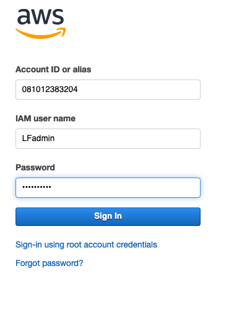
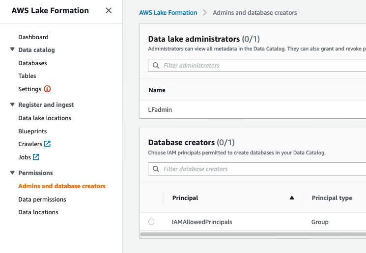
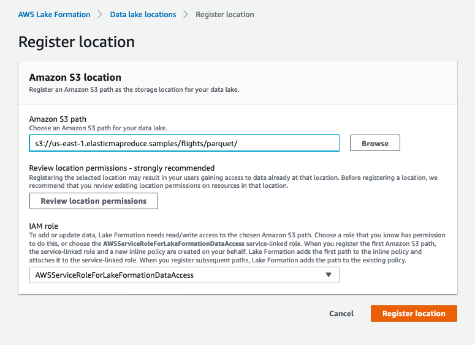
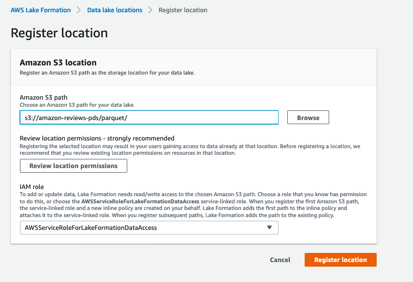

# Part 2 - Setup Lake Formation


## Login as LFadmin user

* Use the username drop-down at the top of the AWS console page and choose "Sign Out".


* Click the "Sign In to the Console" button


* Enter "LFadmin" for the IAM user name.  Enter the Password you used when creating the users for the Password.  Click "Sign In"



* Navigate to the Lake Formation Console.


* Click "Add administrators" button

Note: if you have previously setup Lake Formation in your account, you may see a different initial screen.


* In the drop-down list for "IAM users and roles", choose the "LFadmin" user.


* Click "Save"


## Configure the account to use Lake Formation Security permissions

* On the left-hand column, click on "Settings"



* Uncheck the 2 checkboxes.  Then click "Save"


## Register S3 locations with Lake Formation

* Click on "Dashboard" on the left hand column


* Click on "Register location" button.  In the Amazon S3 Path, enter this value:

```
s3://us-east-1.elasticmapreduce.samples/flights/parquet/
```

* Then click "Register location" button.




* On the Data lake locations page, click "Register location" to add a second location.  In the Amazon S3 Path, enter this value:

```
s3://amazon-reviews-pds/parquet/
```

* Then click "Register location" button.




## Congratulations.

You have done the initial setup of Lake Formation and enabled the Lake Formation security privilege system.  And you have registered the 2 S3 locations that we will use later in this lab.

Proceed onto [Part 3](Part3.md)
